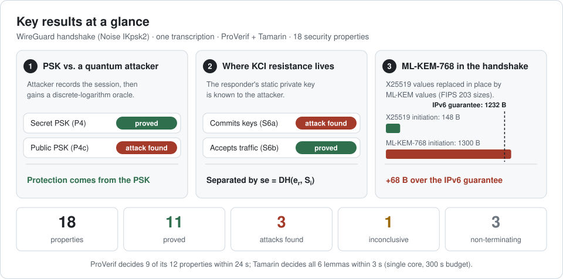
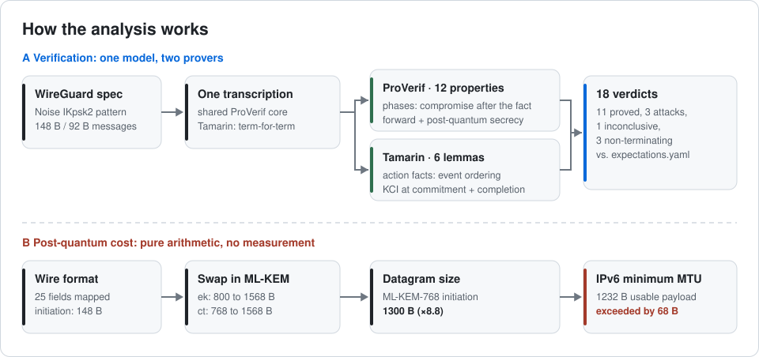
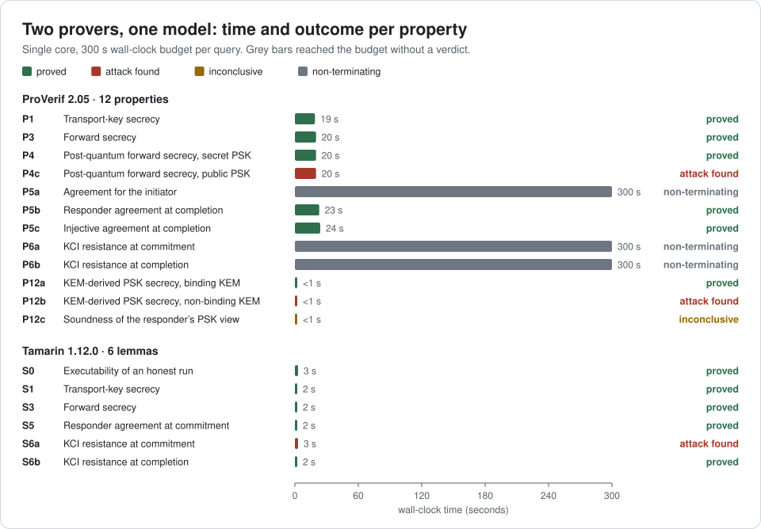

<h1 align="center">WireGuard-Verified</h1>

<p align="center">
  <b>Symbolic verification of the WireGuard handshake with ProVerif and Tamarin,<br>
  and the network-level cost of migrating it to post-quantum cryptography</b>
</p>

<p align="center">Qiyue Zhao</p>

<p align="center">
  <a href="Technical%20Report.pdf"><b>📄 Technical Report (PDF, 17 pages)</b></a>
  &nbsp;·&nbsp;
  <a href="RUNBOOK.md"><b>🛠️ User manual</b></a>
  &nbsp;·&nbsp;
  <a href="#results"><b>📊 Results</b></a>
</p>

<p align="center">
  
  
  
  
  <a href="LICENSE"></a>
</p>

> **Résumé —** Ce projet vérifie formellement la poignée de main de WireGuard (motif Noise IKpsk2) avec deux outils de vérification symbolique, ProVerif et Tamarin, appliqués à une transcription unique du protocole : tout écart entre leurs verdicts est ainsi imputable aux outils, et non à la modélisation. Sur 18 propriétés de sécurité, on obtient 11 preuves, 3 attaques, 1 résultat non concluant et 3 exécutions qui ne terminent pas dans le budget imparti. Trois résultats se dégagent : une expérience contrôlée montre que c’est la clé pré-partagée qui protège les clés de transport face à un adversaire doté d’un oracle de logarithme discret ; la résistance à l’usurpation d’identité après compromission de clé (KCI) se situe précisément entre le moment où le répondeur s’engage sur les clés et celui où il accepte du trafic ; enfin, une initiation ML-KEM-768 transmise dans la poignée de main occupe 1 300 octets, soit 68 octets de plus que la charge utile UDP garantie par le MTU minimal d’IPv6.

<p align="center">
  
</p>

## Highlights

- **The pre-shared key, tested rather than assumed.** Two models differ in one line: against a discrete-logarithm oracle, transport keys stay secret when the PSK is secret (**proved**) and are recovered when it is public (**attack found**).
- **KCI resistance, located.** With the responder's static key leaked, the responder commits keys to a forged session (S6a, **attack found**) but never accepts traffic on it (S6b, **proved**). The static–ephemeral value `se = DH(e_r, S_i)` makes the difference.
- **Post-quantum cost, followed into the network.** An in-band ML-KEM-768 initiation is **1300 B**, **68 B** more than the 1232 B UDP payload that every IPv6 path carries without fragmentation.
- **Two provers, one transcription.** ProVerif decides 9 of 12 properties within 24 s and exhausts the 300 s budget on 3; Tamarin decides all 6 lemmas, including both KCI levels, within 3 s. Undecided queries are reported, not hidden.

## How it works

<p align="center">
  
</p>

1. **One transcription.** The handshake is written once as a ProVerif library that every query includes; the Tamarin theory mirrors it term for term, so differences between verdicts come from the tools.
2. **An explicit adversary.** Compromise is never built in. ProVerif phases model compromise *after* a session (forward and post-quantum secrecy); Tamarin action facts model compromise *during* one (KCI at two levels).
3. **Arithmetic, not measurement.** Post-quantum message sizes follow from the field-by-field wire layout ([`tools/wire.py`](tools/wire.py)) and the ML-KEM parameter sizes of FIPS 203 ([`tools/pqcost.py`](tools/pqcost.py)).

## Results

<p align="center">
  
</p>

| | ProVerif 2.05 | Tamarin 1.12.0 |
|---|:---:|:---:|
| Properties | 12 | 6 |
| Proved | 6 | 5 |
| Attack found | 2 | 1 |
| Inconclusive | 1 | 0 |
| Non-terminating (300 s budget) | 3 | 0 |
| Time to a verdict | < 1–24 s | 2–3 s |

| Key exchange in the initiation | Initiation size | Against the 1232 B IPv6 guarantee |
|---|---:|---|
| X25519 (current) | 148 B | ✅ fits |
| ML-KEM-512 | 916 B | ✅ fits |
| ML-KEM-768 | **1300 B** | ❌ **exceeds by 68 B** |
| ML-KEM-1024 | 1684 B | ❌ exceeds by 452 B |

Attack traces for P4c and S6a are in [`results/traces/`](results/traces/).

<details>
<summary><b>Full result matrix (18 properties), generated from <code>results/results.json</code></b></summary>

<!-- BEGIN GENERATED RESULTS -->
| ID | Property | Tool | Outcome |
|---|---|---|---|
| P1 | Session-key secrecy | ProVerif | proved |
| P3 | Forward secrecy | ProVerif | proved |
| P4 | Post-quantum forward secrecy (psk) | ProVerif | proved |
| P4c | same, psk absent (control) | ProVerif | attack found |
| P5a | Agreement, responder to initiator | ProVerif | non-terminating |
| P5b | Agreement, initiator to responder | ProVerif | proved |
| P5c | Injective agreement / replay (P9) | ProVerif | proved |
| P6a | KCI, commitment level | ProVerif | non-terminating |
| P6b | KCI, completion level | ProVerif | non-terminating |
| P12a | KEM-derived psk secrecy, K-PK binding | ProVerif | proved |
| P12b | same, binding absent (control) | ProVerif | attack found |
| P12c | KEM-derived psk, responder-view soundness | ProVerif | inconclusive |
| S0 | Model admits an honest run | Tamarin | proved |
| S1 | Session-key secrecy | Tamarin | proved |
| S3 | Forward secrecy | Tamarin | proved |
| S5 | Agreement, no compromise | Tamarin | proved |
| S6a | KCI, commitment level | Tamarin | attack found |
| S6b | KCI, completion level | Tamarin | proved |
<!-- END GENERATED RESULTS -->

</details>

## Repository layout

```text
wireguard-verified/
├── Technical Report.pdf    technical report (LNCS format, 17 pages)
├── run.sh                  one command: install, verify, figures, tables
├── Makefile                individual steps (make help)
├── expectations.yaml       expected verdict for each of the 18 properties
├── models/
│   ├── proverif/           ProVerif queries and the shared handshake library (lib/)
│   │   └── pq/             KEM-derived pre-shared key models
│   └── tamarin/            Tamarin theory (6 lemmas)
├── results/
│   ├── results.json        machine-readable verdicts
│   ├── raw/                verbatim prover output
│   ├── traces/             attack traces
│   └── figures/            SVG figures generated from results.json
├── docs/
│   ├── figures/            figures used in this README
│   ├── generated/          result tables generated from results.json
│   └── *.md                wire-to-model table, post-quantum cost, tool comparison
├── scripts/, tools/        runner, result collection, checks, generators
├── lab/                    Linux network-namespace lab (not exercised in this release)
├── RUNBOOK.md              user manual
└── LICENSE
```

## Requirements

| Component | Version used | Notes |
|---|---|---|
| OS | macOS 26 on Apple M1 (8 GB) · Linux x86-64 / arm64 | a single core is enough |
| Python | 3.12 (3.9+ supported) | standard library only |
| ProVerif | 2.05 | installed by `run.sh` (opam) |
| Tamarin | 1.12.0, with Maude 3.2+ | installed by `run.sh` (Homebrew) |

## Quick start

```sh
git clone https://github.com/QiyueZhao-Academic/wireguard-verified.git
cd wireguard-verified
bash run.sh
```

`bash run.sh` installs whichever prover is missing, verifies all 18 properties against `expectations.yaml`, regenerates the figures and tables, and prints a summary, in about nine minutes on an M1. The options `--check`, `--install` and `--run` perform a single stage.

**User manual:** manual installation, every `make` target and troubleshooting are covered in **[RUNBOOK.md](RUNBOOK.md)**.

## Citation

```bibtex
@misc{zhao2026wireguard,
  author       = {Qiyue Zhao},
  title        = {Symbolic Verification of the {WireGuard} Handshake and Its Post-Quantum Migration Cost},
  howpublished = {Technical report},
  year         = {2026},
  url          = {https://github.com/QiyueZhao-Academic/wireguard-verified}
}
```

## Licence

Released under the MIT licence; see [LICENSE](LICENSE).
